# ✦ NovaMind — Enterprise-Grade Full-Stack AI Chatbot

[](https://nodejs.org/)
[](https://react.dev/)
[](https://vitejs.dev/)
[](https://tailwindcss.com/)
[](https://ai.google.dev/)
[](https://prometheus.io/)

NovaMind is a production-hardened full-stack AI chatbot platform. It combines a React + Vite SPA with a Node.js + Express REST/SSE API and delivers multi-model Gemini key rotation, RAG document ingestion via BullMQ + Pinecone, AI-driven memory extraction, JWT dual-token authentication, Prometheus telemetry, and PWA offline support.

---

## 🏛️ System Architecture

```mermaid
graph TD
    User([Client Browser])

    subgraph Frontend["Frontend (Vercel)"]
        Vite[React SPA / Vite 8]
        PWA[PWA Service Worker]
        KaTeX[KaTeX Math Engine]
    end

    subgraph Backend["Backend (Render)"]
        Express[Express.js + SSE]
        Pino[Pino JSON Logger]
        Metrics[Prometheus Registry]
        BullMQ[BullMQ Ingest Worker]
    end

    subgraph Data["Database Layer"]
        MongoDB[(MongoDB Atlas)]
        Redis[(Upstash Redis)]
        Pinecone[(Pinecone Vector DB)]
    end

    subgraph External["External Services"]
        Gemini[Gemini API — 3-Key Rotation]
        Tavily[Tavily Web Search]
        Cloudinary[Cloudinary CDN]
        Resend[Resend Email OTP]
    end

    User -->|HTTPS| Vite
    Vite --> PWA
    Vite --> KaTeX
    Vite -->|REST / SSE| Express
    Express --> Pino
    Express --> Metrics

    Express --> MongoDB
    Express --> Redis
    Express --> Pinecone
    Express --> Cloudinary
    Express --> Gemini
    Express --> Tavily
    Express --> Resend

    Redis -->|Ingest Jobs| BullMQ
    BullMQ --> Gemini
    BullMQ --> Pinecone
```



---

## ⚙️ Project Structure

```plaintext
chatbot-project/
├── docker-compose.yaml              # Orchestrates backend, frontend, MongoDB & Redis
├── package.json                     # Workspace scripts (dev, install:all)
│
├── backend/                         # Express REST/SSE API
│   ├── server.js                    # Entry point — connects DB, starts BullMQ workers
│   ├── app.js                       # CORS, body parsers, rate limiting, metrics middleware
│   │
│   ├── core/
│   │   ├── ai/
│   │   │   ├── chunkers/            # Text chunking strategies by file type
│   │   │   └── parsers/             # Document parsers (PDF, PPTX, DOCX, XLSX, TXT, CSV)
│   │   ├── config/
│   │   │   ├── gemini.js            # Multi-key round-robin Gemini initializer
│   │   │   ├── metrics.js           # Prometheus metrics registry
│   │   │   ├── redis.js             # BullMQ Redis connection
│   │   │   └── systemPrompt.js      # Base system prompt constant
│   │   ├── db/
│   │   │   ├── connect.js           # MongoDB connection handler
│   │   │   └── seed.js              # Dev/test seed script
│   │   ├── middleware/
│   │   │   ├── auth.js              # JWT requireAuth gatekeeper
│   │   │   ├── errorHandler.js      # Global structured JSON error handler
│   │   │   ├── metricsMiddleware.js # HTTP request timing for Prometheus
│   │   │   └── rateLimit.js         # Per-route rate limiters
│   │   └── services/
│   │       ├── emailService.js      # OTP emails via Resend
│   │       ├── embeddingService.js  # Gemini text embeddings (batched, rate-safe)
│   │       ├── geminiService.js     # Streaming + fallback Gemini wrappers
│   │       ├── pineconeService.js   # Vector upsert & similarity search
│   │       └── tavilyService.js     # Real-time web search API
│   │
│   ├── modules/
│   │   ├── auth/                    # Register, OTP verify, login, password reset, delete
│   │   ├── chat/                    # SSE streaming, web search injection, RAG context
│   │   ├── memory/                  # AI-driven user fact extraction (fire-and-forget)
│   │   ├── messages/                # FIFO-capped conversation history (200 msgs/session)
│   │   ├── models/                  # MongoDB TTL model cooldown definitions
│   │   ├── sessions/                # Chat room creation, listing, naming
│   │   └── upload/
│   │       ├── upload.controller.js # Signature gen, ingest queue, status polling, cancel
│   │       ├── upload.routes.js     # /api/upload/* route bindings
│   │       ├── models/
│   │       │   └── FileRegistry.model.js  # Tracks ingest state per uploaded file
│   │       ├── queues/
│   │       │   ├── ingestQueue.js   # BullMQ queue definition
│   │       │   └── ingestWorker.js  # Parse → chunk → embed → upsert worker pipeline
│   │       └── utils/
│   │           └── mimeValidator.js # File signature / magic-byte validator
│   │
│   ├── routes/                      # Top-level Express router aggregator
│
└── frontend/                        # React + Vite SPA
    ├── index.html                   # Base HTML — fonts, KaTeX CDN
    ├── vite.config.js               # Dev proxy, PWA manifest, build config
    │
    └── src/
        ├── App.jsx                  # Route guards & silent token refresher
        ├── main.jsx                 # React DOM mount point
        ├── index.css                # Design system tokens + component styles
        │
        ├── config/
        │   └── api.js               # Fetch client with 401 refresh-retry queue
        │
        ├── core/
        │   ├── components/          # Toast, ErrorMessage, ErrorBoundary, loaders
        │   └── context/             # AuthGate, providers
        │
        └── features/
            ├── auth/                # OTP registration & login screens
            ├── chat/                # Message list, streaming, file upload
            │   └── components/
            │       ├── ChatHeader.jsx       # Session title bar & controls
            │       ├── ChatInput.jsx        # Upload orchestration + localStorage persistence
            │       ├── ChatMessage.jsx      # Individual message bubble renderer
            │       ├── ChatMessages.jsx     # Message list container with scroll management
            │       ├── CodeBlock.jsx        # Syntax-highlighted code block
            │       ├── EditMessageBox.jsx   # Inline message edit UI
            │       ├── FilePreview.jsx      # File card — uploading/retrying/done/failed states
            │       ├── MainArea.jsx         # Chat layout shell
            │       ├── MarkdownRenderer.jsx # Full markdown + KaTeX rendering pipeline
            │       ├── MessageActions.jsx   # Copy, edit, regenerate action bar
            │       ├── MessageList.jsx      # Virtualised message list wrapper
            │       ├── ModelSelector.jsx    # AI model switcher dropdown
            │       ├── VersionNavigator.jsx # Edit-version prev/next navigator
            │       └── WelcomeScreen.jsx    # Empty-session welcome prompt grid
            ├── sessions/            # Sidebar, debounced search, session management
            └── settings/            # AI memory, theme, customization panels
```

---

## 💾 Database Schema (MongoDB)

| Collection | Purpose |
|---|---|
| `users` | Authentication credentials, bcrypt hash, OTP status |
| `sessions` | Conversation rooms — FIFO capped at 200 messages |
| `messages` | User ↔ AI message pairs with full-text search index |
| `memories` | Extracted user facts, indexed by `{userId, createdAt}` |
| `modelcooldowns` | TTL collection — auto-expires on cooldown completion |
| `fileregistries` | Per-file ingest state tracking (queued → indexed) |

---

## 🧠 AI Memory System

NovaMind extracts and stores personal facts about each user across sessions, so the AI builds a persistent understanding of who you are over time.

### Two parallel save paths

#### 1. Implicit extraction (best-effort)
Every user message is evaluated after the AI response completes (fire-and-forget, never blocking). A lightweight LLM pass (`gemini-3.1-flash-lite`) extracts personal facts and stores them in the `memories` collection. The extraction LLM itself decides what's worth saving — if nothing clearly personal is found, it returns `[]` and nothing is stored.

Fast-path skips are applied before the LLM call to conserve quota:
- Messages shorter than 8 characters
- Pure conversational openers (`hi`, `thanks`, `ok`, etc.)
- Pure questions with no first-person reference (`what is X?`)

#### 2. Explicit save (guaranteed)
When a user explicitly asks to save something, the fact is **guaranteed** to be stored regardless of LLM judgment:

> "Remember that I prefer TypeScript over JavaScript"  
> "Don't forget I'm a senior MERN developer"  
> "Keep in mind that I work in dark mode"

Trigger phrases detected (apostrophe-tolerant — matches `don't`, `don't`, and `dont` equally):
- `remember that / this`
- `save this / that`
- `don't forget / dont forget that / this`
- `won't forget / wont forget`
- `can't forget / cant forget`
- `keep in mind that / this`
- `note that / this`
- `for future reference`
- `always remember` / `please remember`

The LLM cleans the phrasing (strips the trigger phrase, rephrases as a neutral fact). If the LLM call fails, the raw message with the trigger phrase stripped is stored as a fallback — the fact is **never silently lost**. Deduplication still applies (near-identical memories are skipped), but there is **no cap on facts per message** on the explicit path.

### Memory injection into Gemini

Retrieved memories are injected directly into the **Gemini system instruction** (not the user message body) as a `=== User Memory Profile ===` block on every chat request. This means memories function as persistent persona context — Gemini sees them at the same level as its core behavioral instructions, not as ephemeral per-request input. The system instruction instructs Gemini to use memory only when directly relevant, leaving relevance judgment to the model rather than gating injection.

### Memory lifecycle
- Memories are **user-scoped** — they persist across all sessions and are never deleted when a chat session is deleted.
- Memories are deleted only when the account itself is deleted (full cascade).
- Users can view and manage stored memories in **Settings → AI Memory**.

---

## 🔍 Web Search

NovaMind automatically runs real-time Tavily web search when a query requires current or time-sensitive information. The search pipeline uses an LLM to rewrite the user's query into an optimised search string before hitting the Tavily API, then injects the results into the user message body with strict grounding instructions for Gemini.

Search results are prepended to the user message as a `=== Web Search Results ===` block. When this marker is present, `geminiService.js` appends strict grounding instructions to the system prompt: prioritise search facts over training data, do not hallucinate, do not include source URLs in the reply.

---

## 📄 RAG Document Pipeline

1. **Client** → requests a signed Cloudinary upload URL (`GET /api/upload/signature`)
2. **Client** → uploads file directly to Cloudinary CDN
3. **Client** → calls `POST /api/upload/ingest` → queues a BullMQ job
4. **BullMQ Worker** (`ingestWorker.js`):
   - Downloads file from Cloudinary
   - Validates magic-byte signature
   - Parses document (PDF, DOCX, PPTX, XLS, CSV, TXT)
   - Chunks text using file-type-specific strategy
   - Embeds chunks via Gemini Embedding API (batched, 100 RPM safe)
   - Upserts vectors into Pinecone
5. **Client** polls `GET /api/upload/ingest/:jobId` → shows live progress bar
6. **File card** persists in `localStorage` — survives page refresh, server restart, and HMR
7. **Viewport-wide Drag and Drop**: Allows dropping files anywhere on the browser window, showing a premium glassmorphic upload backdrop.

Supported file types: `jpg`, `jpeg`, `png`, `webp`, `gif`, `pdf`, `docx`, `doc`, `xlsx`, `xls`, `pptx`, `ppt`, `txt`, `csv`

### 🔒 Upload Limits & Rates

- **Per-message limit**: Maximum **2 files per message** (shared between images and documents).
- **Daily document quota** (rolling 24-hour window, per user):

| Category | Extensions | Daily limit |
|---|---|---|
| `pdf` | `.pdf` | 2 files |
| `word` | `.docx`, `.doc` | 2 files |
| `excel` | `.xlsx`, `.xls`, `.csv` | 2 files |
| `powerpoint` | `.pptx`, `.ppt` | 2 files |
| `text` | `.txt` | **Unlimited** |
| `image` | `.jpg`, `.jpeg`, `.png`, `.webp`, `.gif` | **Unlimited** |

- **Images bypass the RAG pipeline entirely** — they are uploaded to Cloudinary and sent inline to Gemini Vision. No BullMQ job, no Pinecone upsert, and no daily quota is applied.
- **Failed uploads do not count** against the daily quota.
- **Quota is not refunded** on file or session deletion — it resets automatically after 24 hours.
- **File size limit**: 10 MB per file.

---

## 🗑️ Account Deletion (Full Cascade)

Deleting an account removes all associated data in parallel:

| Data | Where |
|---|---|
| User document | MongoDB `users` collection |
| All chat sessions | MongoDB `sessions` collection |
| All messages | MongoDB `messages` collection |
| All stored memories | MongoDB `memories` collection |
| All file registry entries | MongoDB `fileregistries` collection |
| All document chunks | MongoDB `documentchunks` collection |
| All document manifests | MongoDB `documentmanifests` collection |
| All uploaded files | Cloudinary CDN (by `publicId`) |
| All vector embeddings | Pinecone index (by `userId` namespace/filter) |

The deletion uses `Promise.allSettled` — individual failures are logged but do not block the rest of the cascade.

---

## ✨ Smart Features & Interaction

* **Checkmark Copy Action**: Clicking any copy icon or button (for message logs, robot responses, or code snippets) changes the icon to a checkmark or `✓ Copied!` for 5 seconds. Copying is disabled during this period to prevent double-triggering. The copy action is fully restored after the 5-second timeout.
* **Mobile Settings Access**: On viewports below 1024px, the header exposes a settings gear icon (⚙) that opens the full settings panel directly — no sidebar required.

---

## 📈 Prometheus Telemetry (`GET /metrics`)

Secured via `X-Metrics-Secret` header.

| Metric | Type | Description |
|---|---|---|
| `http_requests_total` | Counter | Requests by method, route, status |
| `http_request_duration_seconds` | Histogram | REST & SSE latency |
| `active_sse_streams` | Gauge | Live streaming connections |
| `mongodb_connections_active` | Gauge | Open connection pool size |
| `gemini_model_usage_total` | Counter | API calls per Gemini model |
| `memory_extractions_total` | Counter | Facts saved by the memory system |

---

## 🚀 Quick Start

### 1 — Create `backend/.env`

```env
# Server
PORT=5000
NODE_ENV=development
ALLOWED_ORIGIN=http://localhost:5173

# MongoDB
MONGODB_URI=mongodb://localhost:27017/novamind

# Gemini — up to 3 keys for 3× daily quota (at least KEY_1 required)
GEMINI_API_KEY_1=your_primary_key
GEMINI_API_KEY_2=your_second_key
GEMINI_API_KEY_3=your_third_key

# Email OTP
RESEND_API_KEY=your_resend_api_key
RESEND_FROM=NovaMind <onboarding@resend.dev>

# Cloudinary CDN (file uploads)
CLOUDINARY_CLOUD_NAME=your_cloud_name
CLOUDINARY_API_KEY=your_api_key
CLOUDINARY_API_SECRET=your_api_secret

# Redis + BullMQ (background jobs) — Upstash (free tier, TLS)
REDIS_URL=rediss://default:<password>@<host>.upstash.io:6379

# Pinecone Vector DB (RAG)
PINECONE_API_KEY=your_pinecone_key
PINECONE_INDEX=novamind

# Tavily Web Search
TAVILY_API_KEY=your_tavily_key

# Secrets
JWT_ACCESS_SECRET=min_32_chars_access_secret
JWT_REFRESH_SECRET=min_32_chars_refresh_secret
METRICS_SECRET=min_8_chars_metrics_secret
```

### 2 — Install & Run

```bash
# Install all workspaces
npm run install:all

# Boot both servers concurrently
npm run dev
```

| Service | URL |
|---|---|
| Frontend | http://localhost:5173 |
| Backend API | http://localhost:5000/api |
| Prometheus | http://localhost:5000/metrics |

---

## 🔒 Production Deployment

### Backend → Render
1. Create a new **Web Service** on Render and link your GitHub repository.
2. Set the **Root Directory** to `backend`, choose **Node** environment, set build command to `npm install`, and start command to `npm start`.
3. Add all environment variables from `backend/.env.example` in the Render environment settings.
4. Set `REDIS_URL` to your Upstash `rediss://` connection URL.
5. Set `ALLOWED_ORIGIN` to your Vercel frontend URL.

### Frontend → Vercel
1. Import your GitHub repository in Vercel. Set **Framework Preset** to Vite and the **Root Directory** to `frontend`.
2. Add the environment variable `VITE_API_URL` pointing to your Render backend URL (e.g. `https://novamind-api.onrender.com`).
3. Deploy — NovaMind is live.

