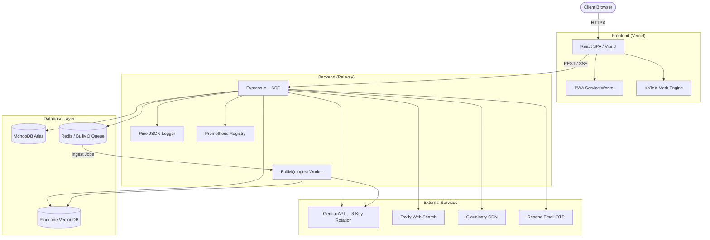

# ✦ NovaMind — Enterprise-Grade Full-Stack AI Chatbot

[](https://nodejs.org/)
[](https://react.dev/)
[](https://vitejs.dev/)
[](https://tailwindcss.com/)
[](https://ai.google.dev/)
[](https://www.docker.com/)
[](https://prometheus.io/)

NovaMind is a production-hardened full-stack AI chatbot platform. It combines a React + Vite SPA with a Node.js + Express REST/SSE API and delivers multi-model Gemini key rotation, RAG document ingestion via BullMQ + Pinecone, AI-driven memory extraction, JWT dual-token authentication, Prometheus telemetry, and PWA offline support.

---

## 🏛️ System Architecture



---

## ⚙️ Project Structure

```plaintext
chatbot-project/
├── docker-compose.yaml              # Orchestrates backend, frontend, MongoDB & Redis
├── package.json                     # Workspace scripts (dev, install:all)
│
├── backend/                         # Express REST/SSE API
│   ├── server.js                    # Entry point — connects DB, starts BullMQ workers
│   ├── app.js                       # CORS, body parsers, rate limiting, metrics middleware
│   │
│   ├── core/
│   │   ├── ai/
│   │   │   ├── chunkers/            # Text chunking strategies by file type
│   │   │   └── parsers/             # Document parsers (PDF, PPTX, DOCX, XLSX, TXT, CSV)
│   │   ├── config/
│   │   │   ├── gemini.js            # Multi-key round-robin Gemini initializer
│   │   │   ├── metrics.js           # Prometheus metrics registry
│   │   │   ├── redis.js             # BullMQ Redis connection
│   │   │   └── systemPrompt.js      # System prompt builder with memory injection
│   │   ├── db/
│   │   │   ├── connect.js           # MongoDB connection handler
│   │   │   └── seed.js              # Dev/test seed script
│   │   ├── middleware/
│   │   │   ├── auth.js              # JWT requireAuth gatekeeper
│   │   │   ├── errorHandler.js      # Global structured JSON error handler
│   │   │   ├── metricsMiddleware.js # HTTP request timing for Prometheus
│   │   │   └── rateLimit.js         # Per-route rate limiters
│   │   └── services/
│   │       ├── emailService.js      # OTP emails via Resend
│   │       ├── embeddingService.js  # Gemini text embeddings (batched, rate-safe)
│   │       ├── geminiService.js     # Streaming + fallback Gemini wrappers
│   │       ├── pineconeService.js   # Vector upsert & similarity search
│   │       └── tavilyService.js     # Real-time web search API
│   │
│   ├── modules/
│   │   ├── auth/                    # Register, OTP verify, login, password change, delete
│   │   ├── chat/                    # SSE streaming, Tavily injection, full-text search
│   │   ├── memory/                  # AI-driven user fact extraction (fire-and-forget)
│   │   ├── messages/                # FIFO-capped conversation history (200 msgs/session)
│   │   ├── models/                  # MongoDB TTL model cooldown definitions
│   │   ├── sessions/                # Chat room creation, listing, naming
│   │   └── upload/
│   │       ├── upload.controller.js # Signature gen, ingest queue, status polling, cancel
│   │       ├── upload.routes.js     # /api/upload/* route bindings
│   │       ├── models/
│   │       │   └── FileRegistry.model.js  # Tracks ingest state per uploaded file
│   │       ├── queues/
│   │       │   ├── ingestQueue.js   # BullMQ queue definition
│           │   └── cancelService.js # Cloudinary delete + Pinecone vector cleanup
│           └── utils/
│               └── mimeValidator.js # File signature / magic-byte validator
│
│   ├── routes/                      # Top-level Express router aggregator
│
└── frontend/                        # React + Vite SPA
    ├── index.html                   # Base HTML — fonts, KaTeX CDN
    ├── vite.config.js               # Dev proxy, PWA manifest, build config
    │
    └── src/
        ├── App.jsx                  # Route guards & silent token refresher
        ├── main.jsx                 # React DOM mount point
        ├── index.css                # Design system tokens + component styles
        │
        ├── config/
        │   └── api.js               # Fetch client with 401 refresh-retry queue
        │
        ├── core/
        │   ├── components/          # Toast, ErrorMessage, ErrorBoundary, loaders
        │   └── context/             # AuthGate, providers
        │
        └── features/
            ├── auth/                # OTP registration & login screens
            ├── chat/                # Message list, streaming, file upload
            │   └── components/
            │       ├── ChatInput.jsx    # Upload orchestration + localStorage persistence
            │       └── FilePreview.jsx  # File card — uploading/retrying/done/failed states
            ├── sessions/            # Sidebar, debounced search, session management
            └── settings/            # AI memory, theme, customization panels
```

---

## 💾 Database Schema (MongoDB)

| Collection | Purpose |
|---|---|
| `users` | Authentication credentials, bcrypt hash, OTP status |
| `sessions` | Conversation rooms — FIFO capped at 200 messages |
| `messages` | User ↔ AI message pairs with full-text search index |
| `memories` | Extracted user facts, indexed by `{userId, createdAt}` |
| `modelcooldowns` | TTL collection — auto-expires on cooldown completion |
| `fileregistries` | Per-file ingest state tracking (queued → indexed) |

---

## 📄 RAG Document Pipeline

1. **Client** → requests a signed Cloudinary upload URL (`GET /api/upload/signature`)
2. **Client** → uploads file directly to Cloudinary CDN
3. **Client** → calls `POST /api/upload/ingest` → queues a BullMQ job
4. **BullMQ Worker** (`ingestWorker.js`):
   - Downloads file from Cloudinary
   - Validates magic-byte signature
   - Parses document (PDF, DOCX, PPTX, XLS, CSV, TXT)
   - Chunks text using file-type-specific strategy
   - Embeds chunks via Gemini Embedding API (batched, 100 RPM safe)
   - Upserts vectors into Pinecone
5. **Client** polls `GET /api/upload/ingest/:jobId` → shows live progress bar
6. **File card** persists in `localStorage` — survives page refresh, server restart, and HMR
7. **Viewport-wide Drag and Drop**: Allows dropping files anywhere on the browser window, showing a premium glassmorphic upload backdrop.

Supported file types: `jpg`, `jpeg`, `png`, `webp`, `gif`, `pdf`, `docx`, `doc`, `xlsx`, `xls`, `pptx`, `ppt`, `txt`, `csv`

### 🔒 Upload Limits & Rates
- **Message limit**: Users can upload only up to **2 files in a single message**.
- **Daily limit**: Users can upload up to **2 files of each document type** in a rolling 24-hour window. Document categories are:
  - `pdf` (PDF documents)
  - `word` (Word documents: `.docx`, `.doc`)
  - `excel` (Spreadsheets and tabular data: `.xlsx`, `.xls`, `.csv`)
  - `powerpoint` (Presentations: `.pptx`, `.ppt`)
  - `text` (Plain text files: `.txt`)
  - `image` (Images: `.jpg`, `.jpeg`, `.png`, `.webp`, `.gif`)

---

## ✨ Smart Features & Interaction

* **Checkmark Copy Action**: Clicking any copy icon or button (for message logs, robot responses, or code snippets) changes the icon to a checkmark or `✓ Copied!` for 5 seconds. Copying is disabled during this period to prevent double-triggering. The copy action is fully restored after the 5-second timeout.

---

## 📈 Prometheus Telemetry (`GET /metrics`)

Secured via `X-Metrics-Secret` header.

| Metric | Type | Description |
|---|---|---|
| `http_requests_total` | Counter | Requests by method, route, status |
| `http_request_duration_seconds` | Histogram | REST & SSE latency |
| `active_sse_streams` | Gauge | Live streaming connections |
| `mongodb_connections_active` | Gauge | Open connection pool size |
| `gemini_model_usage_total` | Counter | API calls per Gemini model |

---

## 🚀 Quick Start

### 1 — Create `backend/.env`

```env
# Server
PORT=5000
NODE_ENV=development
ALLOWED_ORIGIN=http://localhost:5173

# MongoDB
MONGODB_URI=mongodb://localhost:27017/novamind

# Gemini — up to 3 keys for 3× daily quota (at least KEY_1 required)
GEMINI_API_KEY_1=your_primary_key
GEMINI_API_KEY_2=your_second_key
GEMINI_API_KEY_3=your_third_key

# Email OTP
RESEND_API_KEY=your_resend_api_key
RESEND_FROM=NovaMind <onboarding@resend.dev>

# Cloudinary CDN (file uploads)
CLOUDINARY_CLOUD_NAME=your_cloud_name
CLOUDINARY_API_KEY=your_api_key
CLOUDINARY_API_SECRET=your_api_secret

# Redis + BullMQ (background jobs)
REDIS_URL=redis://localhost:6379

# Pinecone Vector DB (RAG)
PINECONE_API_KEY=your_pinecone_key
PINECONE_INDEX=novamind

# Tavily Web Search
TAVILY_API_KEY=your_tavily_key

# Secrets
JWT_ACCESS_SECRET=min_32_chars_access_secret
JWT_REFRESH_SECRET=min_32_chars_refresh_secret
METRICS_SECRET=min_8_chars_metrics_secret
```

### 2 — Install & Run

```bash
# Install all workspaces
npm run install:all

# Start local MongoDB + Redis (optional — skip if you use Atlas / Redis Cloud)
docker-compose up -d novamind-mongo novamind-redis

# Boot both servers concurrently
npm run dev
```

| Service | URL |
|---|---|
| Frontend | http://localhost:5173 |
| Backend API | http://localhost:5000/api |
| Prometheus | http://localhost:5000/metrics |

---

## 🔒 Production Deployment

### Backend → Railway
1. Create a Railway project and add a **Redis** service.
2. Link your GitHub repo and set **Root Directory** to `/backend`.
3. Add all environment variables. Set `REDIS_URL` to the internal Railway Redis URL.
4. Generate a public domain and update `ALLOWED_ORIGIN` to your Vercel URL.

### Frontend → Vercel
1. Import your GitHub repo in Vercel. Set **Framework Preset** to Vite, **Root Directory** to `frontend`.
2. Add environment variable `VITE_API_URL` pointing to your Railway backend URL.
3. Deploy — NovaMind is live.

### Docker (self-hosted)
```bash
docker-compose up --build
```
Spins up: backend, frontend (nginx), MongoDB, and Redis.
